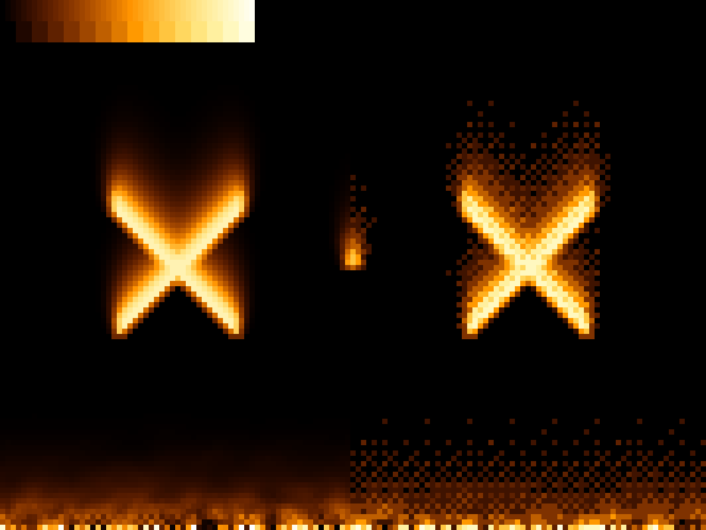
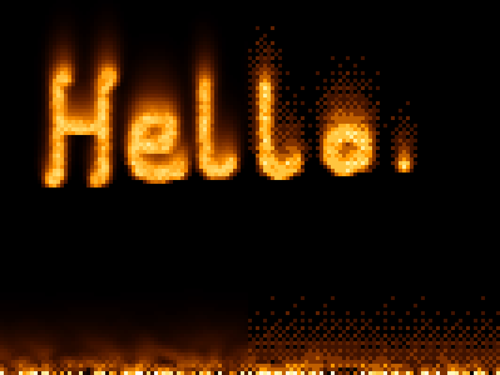

# Oldskool Fire Effect
Used this little app to make myself a pfp.

I followed this tutorial for the fire effect itself: https://lodev.org/cgtutor/fire.html
Ordered dithering: https://www.youtube.com/watch?v=IviNO7iICTM, https://en.wikipedia.org/wiki/Ordered_dithering, https://www.youtube.com/watch?v=0L2n8Tg2FwI

# Building
```bash
mkdir build
cd build
cmake ..
make
./fireEffect [fire ball radius] [fire lifetime] [zoom]
```

# Screenshots

